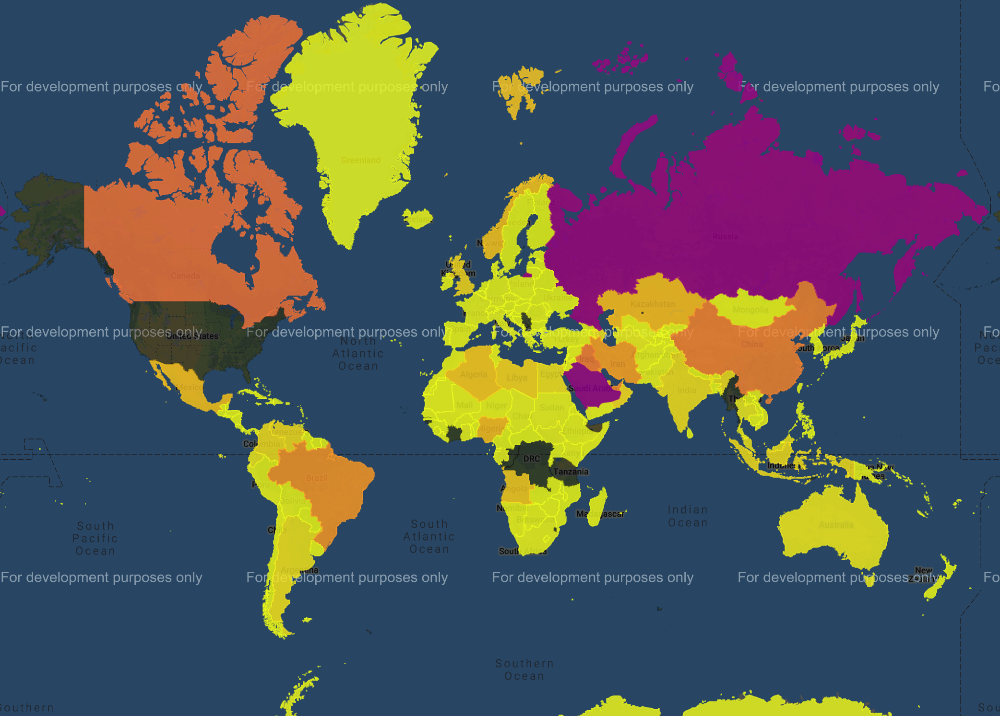

# Final Project - Oil Market Analysis: Critical Price Factors

Data Science and Visualization Boot Camp (Northwestern University)


[](http://commonmark.org)
[](http://hits.dwyl.com/OlegRyzhkov2020/oil-project)


[](https://www.jsdelivr.com/package/npm/chart.js)

## Project Hypothesis



## Data Collection, Cleaning, Normalization

```python
# US Energy Information Administration API Query Browser, Open Data Source
class EIA_Client():
    api_key=None
    def __init__(self, api_key=creds.eai_key, data='category', *args, **kwargs):
        super().__init__(*args, **kwargs)
        if api_key == None:
            raise Exception('Api key is required')
        self.api_key = api_key
        self. eia_url = f"http://api.eia.gov/{data}/"
    def category(self, cat = 1293027):
        params = {'api_key': self.api_key, 'category_id':cat}
        params_url = urlencode(params)
        url = f"{self.eia_url}?{params_url}"
        response = requests.get(url).json()
        return response
```
## DataBase Design and ERD

## PostgreSQL Data Import


```sql
SET search_path = countries
--Select two countries data by years (self join)
SELECT p1.year, SUM(p1.oil_production) as USA,
				SUM(p2.oil_production) as RUSSIA
FROM production as p1
INNER JOIN production as p2 ON p1.year=p2.year
WHERE p1.country = 'United States of America' AND p2.country = 'Russia'
GROUP BY p1.year
ORDER BY p1.year DESC
```

## Data Exploration and Analysis


## Data Visualization


## Contacts
[Find Me on
LinkedIn](https://www.linkedin.com/in/oleg-n-ryzhkov/)
